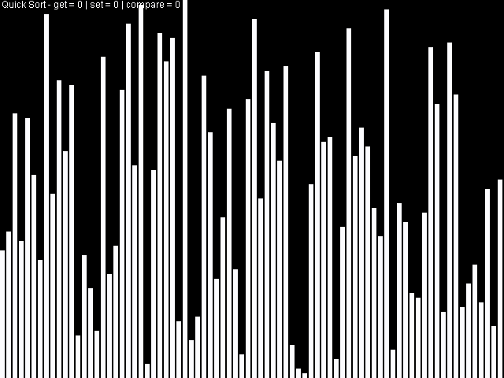

# Algorithm Animation

Quick sort animation

Algorithm Animation is a Java-based algorithm animation generator that can create videos for a wide range of algorithms, including sorting, graph search, Monte Carlo simulations, Fourier transforms, and the Tower of Hanoi.

The `hywt.algo.animation.AnimationGen` class is used to generate animations, and each animation generator extends this class. To generate an animation for a specific algorithm, users need to create an instance of the corresponding `AnimationGen` class in the `hywt.algo.Main` class.

To generate the animations, users need to install `ffmpeg` on their system.

If the user is not familiar with Java, they can use the GUI to select the animation they want to watch. However, if they want to support video saving, they still need to start from Main. In addition, if they want to modify the animation effects, they must modify the specific AnimationGen code.

## AnimationGen Classes

| Class Name | Description |
| ---------- | ----------- |
| BubbleSort | Bubble sort algorithm. |
| SelectionSort | Selection sort algorithm. |
| QuickSort | Quick sort algorithm. |
| MergeSort | Merge sort algorithm. |
| RadixSort | Radix sort algorithm. |
| StoogeSort | Stooge sort algorithm. |
| SlowSort | Slow sort algorithm. |
| BogoSort | Bogo sort algorithm. |
| InsertionSort | Insertion sort algorithm. |
| Hanoi | Tower of Hanoi puzzle. |
| Sudoku | Sudoku puzzle. |
| BFS | Breadth-first search algorithm. |
| RecursiveSplitGenerator | Recursive split generator algorithm. |
| DFS | Depth-first search algorithm. |
| BestFS | Best-first search algorithm. |
| MonetPi | Monte Carlo simulation of pi. |
| LangtonsAnt | Langton's ant on a grid. |
| NormalDistribution | Normal distribution. |
| AnimationTest | Animation test. |
| FunctionGraph | Function graphing. |
| DrawText | Text drawing. |
| Clock | Clock. |
| AllSortings | All the sorting algorithms. |
| GenAndSearch | Generation and search. |
| Astar | A* search algorithm. |
| FFT | Fast Fourier transform.| 